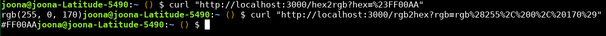
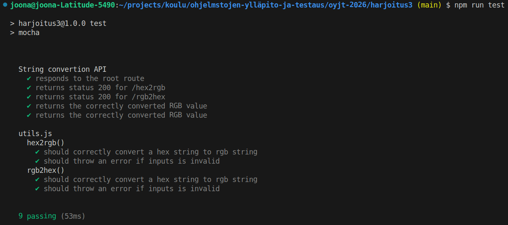

# HEX-RGB String Conversion API

This project implements a simple Node.js Express API that provides endpoints for converting between hexadecimal color codes and RGB color strings.

## Features

- Convert hex color strings (e.g., `#FF0000`) to RGB format (e.g., `rgb(255, 0, 0)`)
- Convert RGB color strings (e.g., `rgb(255, 0, 0)`) to hex format (e.g., `#FF0000`)
- RESTful API endpoints
- Comprehensive integration tests using Supertest and Chai

## Installation

1. Navigate to the project directory:
   ```bash
   cd harjoitus3
   ```

2. Install dependencies:
   ```bash
   npm install
   ```

## Usage

### Running the Server

Start the development server:
```bash
npm run dev
```

The server will run on `http://localhost:3000`.

---
### API Endpoints

#### GET /
Returns a simple greeting message.

**Example:**
```bash
curl http://localhost:3000/
```
**Response:** `Hello`


#### GET /hex2rgb?hex=<hex_value>
Converts a hex color string to RGB format.

**Parameters:**
- `hex`: Hex color string (e.g., `#009aff`)

**Example:**
```bash
curl "http://localhost:3000/hex2rgb?hex=%23009aff"
```
**Response:** `rgb(0, 154, 255)`


#### GET /rgb2hex?rgb=<rgb_value>
Converts an RGB color string to hex format.

**Parameters:**
- `rgb`: RGB color string (e.g., `rgb(0, 154, 255)`)

**Example:**
```bash
curl "http://localhost:3000/rgb2hex?rgb=rgb(0,154,255)"
```
**Response:** `#009AFF`

#### Examples using curl


## Testing

Run the integration tests:
```bash
npm test
```

The tests cover:
- Server startup and basic routes
- Hex to RGB conversion endpoint
- RGB to hex conversion endpoint
- Error handling for invalid inputs

## Test Results

Running `npm test` executes the test suite and displays the results in the terminal. Test results indicate whether the code behaves as expected.

### Example Output




### Interpretation

- **✔**: Indicates a passing test (the code met the expected behavior).
- **Number passing**: Total tests that passed (9 out of 9).
- **Time**: How long the tests took to run (53ms).
- If any tests had failed, they would show with ✗ and details about what went wrong, helping identify bugs.

Successful test results (all passing) confirm that the API endpoints and utility functions work correctly for valid inputs and handle errors appropriately.

## Project Structure

```
harjoitus3/
├── src/
│   ├── server.js      # Express server and API routes
│   └── utils.js       # Utility functions for color conversions
├── test/
│   ├── server.test.js # Integration tests for the API
│   └── utils.test.js  # Unit tests for utility functions
├── docs/
│   └── readme.md      # This documentation
└── package.json       # Project dependencies and scripts
```

## Technologies Used

- **Node.js**: JavaScript runtime
- **Express.js**: Web framework for the API
- **Supertest**: HTTP endpoint testing
- **Chai**: Assertion library for tests
- **Mocha**: Test framework
